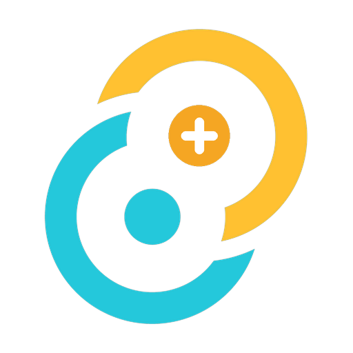

<div align="center">



# CodeDeck+

**Control Claude Code sessions running on your laptop or VPS from your Android
phone, over end-to-end encrypted Nostr.** No accounts and no central server —
the phone and the bridge pair directly by scanning a QR code.

[](https://github.com/deymosh/codedeck-plus/actions/workflows/ci.yml)
[](https://github.com/deymosh/codedeck-plus/releases/latest)
[](LICENSE)

</div>

---

## What it does

Two halves pair directly over Nostr (NIP-44) — no accounts, no server between
them:

- **The bridge** — a headless CLI / systemd connector that runs Claude Code
  sessions on the machine where your code lives and exposes them over encrypted
  Nostr. This repo ships it as a Docker image and an `npx`-installable tarball.
- **The Android app** — drives those sessions from your phone: review plans,
  approve tool permissions, switch models, and chat with several sessions at
  once.

Pairing is a one-time QR scan; it survives restarts and reinstalls on both ends.

- Multiple concurrent Claude Code sessions, switchable from one screen
- Plan approval, permission cards and AskUserQuestion prompts on the phone
- Transcripts that survive restarts, offline gaps and reinstalls (ranged sync)
- Per-session model and effort, plus custom AI provider profiles (Kimi K3,
  OpenRouter, any Anthropic-compatible endpoint)
- Encrypted Nostr DMs — NIP-17 and Marmot (MLS) side by side
- Project/folder management on every paired bridge host

## About this fork

CodeDeck+ is a community-maintained continuation of **CodeDeck Next** by
[JeroenOnNostr](https://github.com/JeroenOnNostr)
([mobile](https://github.com/JeroenOnNostr/codedeck-next-mobile) ·
[bridge](https://github.com/JeroenOnNostr/codedeck-next-bridge)), consolidated
into one pnpm monorepo. It adds infrastructure the upstream projects didn't
design for:

- **NIP-42 `AUTH`** relays — e.g. a self-hosted
  [Haven](https://github.com/bitvora/haven) relay
- the bridge reaching the network only over **Tor** (SOCKS5)
- the phone routing through **Orbot** (Android's Tor app)

The original MIT license and attribution are preserved; `vendor/` keeps
pristine `git subtree` mirrors of both upstreams. Docker builds and runs only
the **bridge**; the Android app lives here too (for the shared packages and its
own Tor/Orbot patch) but builds with its own Android/Rust toolchain.

## Repository layout

```
codedeck-plus/
├── vendor/              # pristine git-subtree mirrors of upstream — never hand-edited
│   ├── bridge/           #   codedeck-next-bridge @ main (carries its own package.json / pnpm-*,
│   └── mobile/           #   codedeck-next-mobile @ main   inert — not in the workspace glob)
├── packages/             # shared workspace packages (the actual, editable code)
│   ├── protocol/          #   wire format + NIP-42 signer, used by both apps
│   ├── core/               #   bridge engine (Node-only: Tor/SOCKS5 transport lives here)
│   └── testkit/
├── apps/
│   ├── bridge/            # the headless CLI/systemd bridge — what Docker builds
│   └── mobile/             # Tauri v2 + React Android app (not built by Docker)
├── docker/
│   ├── Dockerfile
│   ├── entrypoint.sh
│   └── main.js          # container entry shim (WebSocket global → built bridge CLI)
├── docs/
│   └── PROTOCOL.md      # the wire contract (packages/protocol/src/ is authoritative)
├── scripts/
│   └── sync-upstream.sh  # pulls upstream into vendor/*, for hand-merging
├── .github/workflows/   # ci.yml (typecheck + test + build + cargo) · release.yml (tag → release)
├── .claude/             # CLAUDE.md + skills for Claude Code
├── codedeck             # ./codedeck — bridge / Tor / APK / test wrapper (Docker, no host toolchain)
├── docker-compose.yml
├── pnpm-workspace.yaml
└── data/                 # runtime volume (bridge identity, paired phones, sessions)
```

See `scripts/sync-upstream.sh` for how to pull future upstream changes —
`vendor/*` stays a real `git subtree`, so pulling in new fixes is a real
`git subtree pull`, not a manual re-diff against a tarball. What lands in
`packages/*` and `apps/bridge`/`apps/mobile` after that is still a deliberate,
reviewed merge (they've diverged from `vendor/*` on purpose).

## Local patches on top of upstream

- **NIP-42 relay auth** (`packages/protocol/src/nip42.ts`): the bridge and
  the phone each answer a relay's `AUTH` challenge with their own existing
  identity keypair — no new secret to configure. Just allowlist the bridge's
  pairing npub (and the phone's, if your relay gates reads too) in your
  relay's ACL.
- **Tor/SOCKS5 for the bridge** (`packages/core/src/nostr/transport.ts`):
  set `CODEDECK_TOR_PROXY_URL` and every relay connection routes through it.
  See the optional `codedeck-tor` Compose service below.
- **Orbot for the phone** (`apps/mobile/tauri-plugin-tor-proxy`): a settings
  toggle routes the WebView's relay traffic through Orbot's SOCKS5 proxy via
  `androidx.webkit.ProxyController` — Android-only, off by default.
- Relay reconnection (`BridgePool` / the phone's connection FSM) was already
  solid upstream (epoch-guarded reconnects, exponential backoff) — see the
  code comments in `packages/core/src/nostr/pool.ts` for what's original vs.
  new.

## Environment variables

Create a `.env` file in the root directory:

```env
CLAUDE_CODE_OAUTH_TOKEN=sk-ant-oat...
GITHUB_TOKEN=ghp_...
GIT_USER=your_username
GIT_EMAIL=your_email@example.com
# Comma-separated repositories; cloned under /data/workspaces/<repo-name>
GIT_REPO=https://github.com/your-username/your-repo.git

# Optional — see .env.example for the full explanation of each:
CODEDECK_RELAYS=
CODEDECK_TOR_PROXY_URL=
```

Docker Compose reads the root `.env` file as its environment configuration. It
maps `CLAUDE_CODE_OAUTH_TOKEN` and `GITHUB_TOKEN` from that environment into
Docker secrets, mounted in the container at:

- `/run/secrets/claude_code_oauth_token`
- `/run/secrets/github_token`

The bridge exports `CLAUDE_CODE_OAUTH_TOKEN` because Claude Code needs it. It
does not export `GITHUB_TOKEN` into the bridge or Claude environment: Git reads
the GitHub credential through `git-credential-codedeck-secret`, and `gh` reads
it through `gh-codedeck-secret`. Keep real values only in your untracked
`.env` file, use least-privilege tokens, and rotate them if they appear in
logs or source control.

## Quick start

1. Build and start the container:
```bash
docker compose up -d --build
```

2. **Optional** — also run the bundled Tor daemon (`lncm/tor`), instead of
   pointing `CODEDECK_TOR_PROXY_URL` at a Tor daemon you already run
   elsewhere:
```bash
docker compose --profile tor up -d --build
# then set CODEDECK_TOR_PROXY_URL=socks5h://codedeck-tor:9050 in .env
```

3. Check the logs to scan the pairing QR code with the CodeDeck+ Android app:
```bash
docker compose logs -f codedeck-bridge
```

## Releases

Pushing a `vMAJOR.MINOR.PATCH` tag runs [`.github/workflows/release.yml`](.github/workflows/release.yml),
which publishes one GitHub Release with every artifact of that version:

| Component | Artifact |
|---|---|
| Android app | `codedeck-vX.Y.Z.apk` — release aarch64 build, signed |
| Bridge CLI (`npx` / global install) | `codedeck-bridge-vX.Y.Z.tgz` |
| Bridge container image | `ghcr.io/deymosh/codedeck-plus-bridge:vX.Y.Z` (and `:latest`) |

A tag with a hyphen (`v1.2.3-rc1`) is published as a prerelease and does not move
`:latest`. The version is bumped in the tree in the commit that gets tagged (one
number for the whole monorepo); `workflow_dispatch` runs the same pipeline for a
dry run.

APK signing needs four repository secrets — `SIGNING_KEY` (base64 keystore),
`KEY_ALIAS`, `KEY_STORE_PASSWORD`, `KEY_PASSWORD`. See
[`.claude/skills/cut-release/SKILL.md`](.claude/skills/cut-release/SKILL.md) for
the full runbook.

## More docs

- [`apps/bridge/README.md`](apps/bridge/README.md) — the bridge CLI: commands, config, systemd
- [`apps/mobile/README.md`](apps/mobile/README.md) — the Android app: stack, layout, building an APK
- [`docs/PROTOCOL.md`](docs/PROTOCOL.md) — the v10 wire contract
- [`.claude/skills/cut-release/SKILL.md`](.claude/skills/cut-release/SKILL.md) — the release runbook

## Upstream

- [codedeck-next-mobile](https://github.com/JeroenOnNostr/codedeck-next-mobile) — upstream Android app
- [codedeck-next-bridge](https://github.com/JeroenOnNostr/codedeck-next-bridge) — upstream headless CLI / VPS bridge
