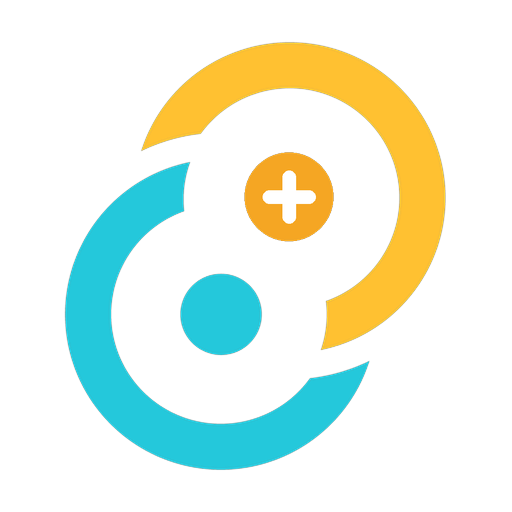

<div align="center">



# CodeDeck+

**Control coding agents (OpenCode, Claude Code, DeepSeek Harness) running on
your laptop or VPS from your Android phone, over end-to-end encrypted
Nostr.** No accounts and no CodeDeck server: the phone and the bridge pair by
scanning a QR code and talk through ordinary Nostr relays — public ones, or
your own.

[](https://github.com/deymosh/codedeck-plus/actions/workflows/ci.yml)
[](https://github.com/deymosh/codedeck-plus/releases/latest)
[](LICENSE)

</div>

---

## What it does

Two halves exchange NIP-44 encrypted messages through one or more Nostr relays
of your choice. The relays only store and forward ciphertext: they cannot read
your sessions, and no account or CodeDeck-run service sits in between.

- **The bridge** — `codedeck-bridge`, a headless service that runs agent
  sessions on the machine where your code lives and exposes them over encrypted
  Nostr. It ships as a Docker image and as Linux and Windows archives
  ([`docs/BRIDGE.md`](docs/BRIDGE.md)).
- **The Android app** — drives those sessions from your phone: review plans,
  approve tool permissions, answer the agent's questions, switch models, and
  chat with several sessions at once ([`docs/CLIENT.md`](docs/CLIENT.md)).

Pairing is a one-time QR scan; it survives restarts on both ends.

- Several concurrent sessions, switchable from one screen
- Plan approval, permission cards and agent questions on the phone
- Transcripts that survive restarts and offline gaps (ranged sync)
- Per-session mode, model and effort, plus custom AI provider profiles (any
  OpenAI- or Anthropic-compatible endpoint or gateway, its models readable
  from the endpoint)
- What fills the context window, part by part, and Claude Code's plan limits
- [OpenCode](https://opencode.ai) (the default, installed on first start),
  Claude Code and the
  [DeepSeek Harness](https://www.deepseek.com/en/harness/) (installed from
  the phone when chosen), picked per session — the protocol is agent-neutral,
  so another agent is one driver away
  ([`docs/PROTOCOL.md`](docs/PROTOCOL.md#adding-an-agent))
- Plugins and MCP servers of each agent, managed from the phone
- File attachments (photos or any file), and project/folder management on every paired bridge
- NIP-42 `AUTH` relays, and Tor on both ends (see below)
- A direct link on your LAN or VPN: the phone talks to the bridge over its
  own WebSocket, with the relays as the fallback

## About this fork

CodeDeck+ is a community-maintained continuation of **CodeDeck Next** by
[JeroenOnNostr](https://github.com/JeroenOnNostr)
([mobile](https://github.com/JeroenOnNostr/codedeck-next-mobile) ·
[bridge](https://github.com/JeroenOnNostr/codedeck-next-bridge)), consolidated
into one repository and since rebuilt: the protocol, the bridge and the phone's
core are Rust, and the Android app is native. It adds infrastructure the
upstream projects didn't design for:

- **NIP-42 `AUTH`** relays — e.g. a self-hosted
  [Haven](https://github.com/bitvora/haven) relay
- the bridge reaching its relays only over **Tor** (SOCKS5)
- the phone routing through **Orbot** (Android's Tor app)

The original MIT license and attribution are preserved. Upstream is not
tracked mechanically any more: the protocol and both halves have been
rewritten, so ideas from upstream are re-implemented here as ordinary changes.

## Repository layout

```
codedeck-plus/
├── crates/              # the Rust workspace
│   ├── protocol/          #   the phone wire (source of truth) + its conformance corpus
│   ├── agent-protocol/    #   the driver protocol: bridge ⇄ agent host
│   ├── nostr-transport/   #   relay WebSocket + SOCKS5 (Tor) driver, NIP-42 AUTH
│   ├── bridge-core/       #   the bridge engine (pure state machine)
│   ├── bridge-runtime/    #   the codedeck-bridge binary
│   ├── client-core/       #   the phone's core (pure)
│   ├── client-runtime/    #   the phone's async host
│   └── client-ffi/        #   UniFFI surface for the Android app
├── packages/
│   └── agent-host/        # Node sidecar running the agent SDKs (one driver per agent)
├── apps/
│   ├── android/           # the native Android app (Kotlin + the Rust client core)
│   └── mobile/            # the former Tauri app — frozen (future desktop client)
├── docker/              # the bridge image (Dockerfile, entrypoint, helpers)
├── deploy/              # systemd unit for the bridge
├── docs/                # PROTOCOL.md (contract), BRIDGE.md, CLIENT.md, one per agent, ROADMAP.md
├── scripts/             # toolchain installer (Linux), shared shell helpers
├── .github/workflows/   # ci.yml · release.yml (tag → release)
├── .claude/             # CLAUDE.md + skills for Claude Code
├── codedeck             # ./codedeck — bridge / Tor / APK / checks wrapper
├── docker-compose.yml
└── data/                # runtime volume (bridge identity, paired phones, sessions)
```

## Relays and Tor

- **NIP-42 relay auth** (`crates/protocol/src/nip42.rs`): the bridge and the
  phone each answer a relay's `AUTH` challenge with their own existing identity
  keypair — no new secret to configure. Just allowlist the bridge's pairing
  npub (and the phone's, if your relay gates reads too) in your relay's ACL.
- **Tor/SOCKS5 for the bridge** (`crates/nostr-transport`): set `torProxyUrl`
  in its `config.json` (or `CODEDECK_TOR_PROXY_URL`) and every relay
  connection routes through it (the agents' own API traffic does not). See
  the optional `codedeck-tor` Compose service below.
- **Orbot for the phone**: a settings toggle routes the app's relay and
  Blossom traffic through Orbot's SOCKS5 proxy — off by default.

## Running the bridge with Docker

Other ways to run it (release archives, systemd, from source) are in
[`docs/BRIDGE.md`](docs/BRIDGE.md).

Two files configure it:

- **`.env`** (copy [`.env.example`](.env.example)) — what the container needs,
  all of it optional: the agents' and GitHub's tokens (or set them on the
  phone), the Git identity and repositories to clone, and a few switches.

  ```env
  CLAUDE_CODE_OAUTH_TOKEN=sk-ant-oat...
  GITHUB_TOKEN=ghp_...
  GIT_USER=your_username
  GIT_EMAIL=your_email@example.com
  # Comma-separated repositories; cloned under /data/workspaces/<repo-name>
  GIT_REPO=https://github.com/your-username/your-repo.git
  ```

- **`data/config.json`** — the bridge's own settings: relays, Tor, OpenCode,
  the direct link, the machine name. The first start creates it with the
  direct link on and the defaults for everything else;
  [`config.example.json`](config.example.json) shows every setting (keep only
  the ones you need), and [`docs/BRIDGE.md`](docs/BRIDGE.md#configuration)
  explains each. Restart the container after editing it.

  The most common of them can be set in `.env` instead (`CODEDECK_RELAYS`,
  `CODEDECK_TOR_PROXY_URL`, the OpenCode and direct-link ones — see
  `.env.example`). Use whichever you prefer: a variable set in `.env` wins
  over `config.json`, and one left unset leaves the file's value in place.

  ```json
  {
    "relays": ["wss://relay.example.com"],
    "direct": { "listen": "0.0.0.0:7447" }
  }
  ```

The direct link is on out of the box: Compose publishes port 7447, and phones
on your network or VPN reach the bridge there without a relay (only paired
phones get past its handshake). Inside a container the bridge cannot see the
host's address, so add it once, either in `config.json`
(`"endpoints": ["wss://192.168.1.20:7447"]` in `direct`) or on the phone, in
the machine's settings. Either works over `wss://` with no certificate setup:
the phone pins the certificate the bridge reports, not a host name.

On a server with a public address, the published port is reachable from the
internet too. Only paired phones get past the handshake, but if you would
rather not expose it, drop the `ports:` entry or bind it to your VPN address
(`"100.64.0.1:7447:7447"`).

Docker Compose reads the root `.env` file as its environment configuration. It
maps `CLAUDE_CODE_OAUTH_TOKEN` and `GITHUB_TOKEN` from that environment into
Docker secrets, mounted in the container at:

- `/run/secrets/claude_code_oauth_token`
- `/run/secrets/github_token`

The bridge exports `CLAUDE_CODE_OAUTH_TOKEN` because Claude Code needs it. It
does not export `GITHUB_TOKEN` into the bridge or Claude environment: Git reads
the GitHub credential through `git-credential-codedeck-secret`, and `gh` reads
it through `gh-codedeck-secret`. Keep real values only in your untracked
`.env` file, use least-privilege tokens, and rotate them if they appear in
logs or source control.

### Start it

1. Build and start the container:
```bash
docker compose up -d --build
```

2. **Optional** — also run the bundled Tor daemon (`lncm/tor`), instead of
   pointing `torProxyUrl` at a Tor daemon you already run elsewhere:
```bash
docker compose --profile tor up -d --build
# then set "torProxyUrl": "socks5h://codedeck-tor:9050" in data/config.json
# (or CODEDECK_TOR_PROXY_URL in .env)
```

3. Check the logs to scan the pairing QR code with the CodeDeck+ Android app:
```bash
docker compose logs -f codedeck-bridge
```

## Releases

Pushing a `vMAJOR.MINOR.PATCH` tag runs [`.github/workflows/release.yml`](.github/workflows/release.yml),
which publishes one GitHub Release with every artifact of that version:

| Component | Artifact |
|---|---|
| Android app | `codedeck-vX.Y.Z.apk` — release aarch64 build, signed |
| Bridge for Linux (binary + agent host + Node; glibc ≥ 2.35) | `codedeck-bridge-vX.Y.Z-linux-x86_64.tar.xz`, `…-linux-aarch64.tar.xz` |
| Bridge for Windows (the same, zipped) | `codedeck-bridge-vX.Y.Z-windows-x86_64.zip` |
| Bridge container image | `ghcr.io/deymosh/codedeck-plus-bridge:vX.Y.Z` (and `:latest`) |

The archives and the image leave out the agents' own binaries: OpenCode, the
default agent, is installed when the bridge first starts, and any other agent
when someone installs it from the phone, pinned to the lockfile (see
[`docs/BRIDGE.md`](docs/BRIDGE.md));
`CODEDECK_BUNDLE_AGENTS=1` builds an image that carries them.

A tag with a hyphen (`v1.2.3-rc1`) is published as a prerelease and does not move
`:latest`. The version is bumped in the tree in the commit that gets tagged (one
number for the whole monorepo); `workflow_dispatch` runs the same pipeline for a
dry run.

APK signing needs four repository secrets — `SIGNING_KEY` (base64 keystore),
`KEY_ALIAS`, `KEY_STORE_PASSWORD`, `KEY_PASSWORD`. See
[`.claude/skills/cut-release/SKILL.md`](.claude/skills/cut-release/SKILL.md) for
the full runbook.

## More docs

- [`docs/BRIDGE.md`](docs/BRIDGE.md) — the bridge: install, commands, config, files, systemd
- [`docs/CLIENT.md`](docs/CLIENT.md) — the phone: the Rust client core, the Android app, transport rules, building the APK
- [`docs/PROTOCOL.md`](docs/PROTOCOL.md) — the v11 wire contract, the driver protocol, adding an agent
- [`docs/OPENCODE.md`](docs/OPENCODE.md) — OpenCode, the default agent: the server it runs on, provider profiles, credentials
- [`docs/CLAUDE-CODE.md`](docs/CLAUDE-CODE.md) — Claude Code: sign-in, modes and models, the 1M window, gateways and provider profiles
- [`docs/DEEPSEEK.md`](docs/DEEPSEEK.md) — the DeepSeek Harness: API key, models and reasoning, gateways, MCP servers and plugins
- [`docs/AGENT-CANDIDATES.md`](docs/AGENT-CANDIDATES.md) — which agents to add next and how
- [`docs/ROADMAP.md`](docs/ROADMAP.md) — work decided but not built yet
- [`.claude/skills/cut-release/SKILL.md`](.claude/skills/cut-release/SKILL.md) — the release runbook

## Upstream

- [codedeck-next-mobile](https://github.com/JeroenOnNostr/codedeck-next-mobile) — upstream Android app
- [codedeck-next-bridge](https://github.com/JeroenOnNostr/codedeck-next-bridge) — upstream headless CLI / VPS bridge
